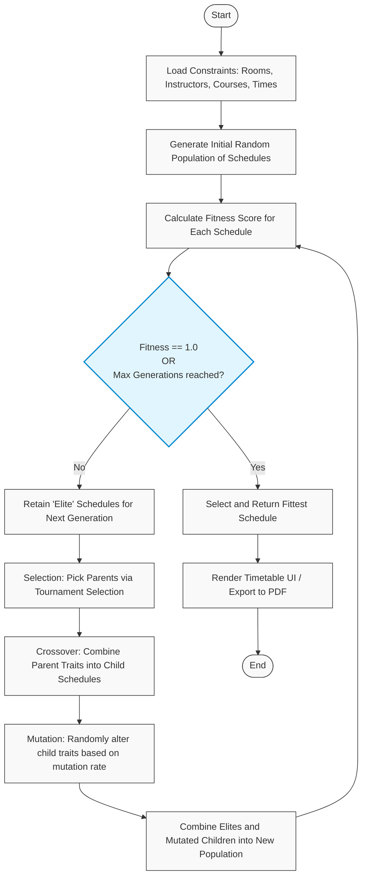

# Genetic Algorithm Flow Diagram

This diagram illustrates the process used by the Timetable Scheduler's genetic algorithm to evolve an optimal schedule.

```mermaid
graph TD
    A([Start]) --> B[Load Constraints: Rooms, Instructors, Courses, Times]
    B --> C[Generate Initial Random Population of Schedules]
    C --> D[Calculate Fitness Score for Each Schedule]
    D --> E{Fitness == 1.0 <br/> OR <br/> Max Generations reached?}
    E -- Yes --> F[Select and Return Fittest Schedule]
    E -- No --> G[Retain 'Elite' Schedules for Next Generation]
    G --> H[Selection: Pick Parents via Tournament Selection]
    H --> I[Crossover: Combine Parent Traits into Child Schedules]
    I --> J[Mutation: Randomly alter child traits based on mutation rate]
    J --> K[Combine Elites and Mutated Children into New Population]
    K --> D
    F --> L[Render Timetable UI / Export to PDF]
    L --> M([End])
    
    classDef default fill:#f9f9f9,stroke:#333,stroke-width:1px;
    classDef decision fill:#e1f5fe,stroke:#0288d1,stroke-width:2px;
    class E decision;
```
