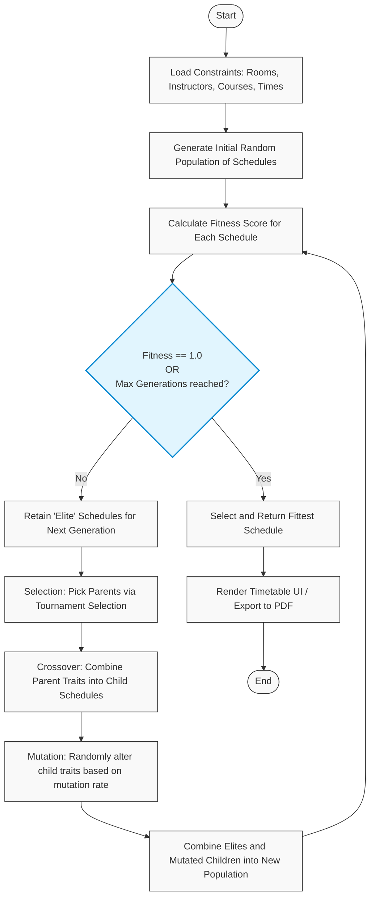

# Timetable Scheduler - Codebase Analysis

## Project Overview
The **Timetable Scheduler** is a Django-based web application designed to automatically generate university timetables. It addresses the "Timetable Scheduling Problem" by using a **Genetic Algorithm (GA)** to satisfy various organizational and physical constraints.

## Tech Stack
- **Framework:** Django 3.2.25
- **Language:** Python 3.6+
- **Frontend:** Django Templates, CSS3, JavaScript (with some jQuery/Select2 in assets)
- **Algorithm:** Genetic Algorithm (Custom implementation in `views.py`)
- **Database:** Django ORM (configured for SQLite by default)

## Key Features
### 1. Automated Timetable Generation
- Uses a Genetic Algorithm to evolve schedules over multiple generations (up to 200).
- **Fitness Function:** Evaluates schedules based on:
    - **Room Capacity:** Ensures room seating ≥ number of students.
    - **Instructor Availability:** Prevents an instructor from being in two places at once.
    - **Section Timing:** Prevents multiple classes for the same section at the same time.
    - **Room Availability:** Prevents room double-booking.

### 2. Entity Management (CRUD)
The system provides a full management interface for all required entities:
- **Instructors:** Manage faculty details.
- **Rooms:** Define classrooms and their seating capacities.
- **Meeting Times:** Set up available time slots and days (Monday-Friday).
- **Courses:** Define course names, IDs, and student limits.
- **Departments:** Group courses into departments.
- **Sections:** Define specific class sections and their weekly requirements.
- **Section-Course Assignments:** Dedicated mapping to assign specific instructors to section-course pairs, providing granular control over scheduling.

### 3. User Interface
- **Dashboard:** Navigation for all management modules.
- **Timetable View:** Displays the final generated schedule in a structured grid format.
- **Authentication:** Secure access to management and generation features via Django's authentication system.

## Data Models
- `Room`: `r_number`, `seating_capacity`
- `Instructor`: `uid`, `name`
- `MeetingTime`: `pid`, `day`, `time` (Choices: 8:45-9:45, 10:00-11:00, etc.)
- `Course`: `course_number`, `course_name`, `max_numb_students`, `instructors` (M2M)
- `Department`: `dept_name`, `courses` (M2M)
- `Section`: `section_id`, `department`, `num_class_in_week`, and scheduling placeholders.
- `SectionCourseAssignment`: Links specific sections and courses to a subset of instructors.

## Genetic Algorithm Details
- **Population Size:** 50
- **Elite Schedules:** 4 (preserved across generations)
- **Mutation Rate:** 0.08
- **Tournament Selection:** Used to pick parents for crossover.
- **Crossover:** Combines two "parent" schedules to produce a "child" schedule.
- **Mutation:** Randomly modifies parts of a schedule to maintain genetic diversity.

### Algorithm Flow Diagram

## File Structure Highlights
- `SchedulerApp/models.py`: Defines the core data structure.
- `SchedulerApp/views.py`: Contains the Genetic Algorithm logic and request handlers.
- `templates/`: HTML structures for the UI.
- `assets/` & `static/`: CSS and JS assets for styling and interactivity.
- `manage.py`: Django entry point for project management.
